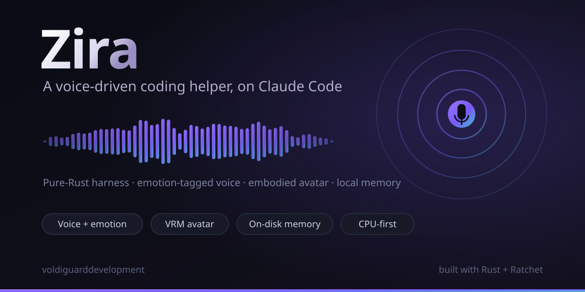
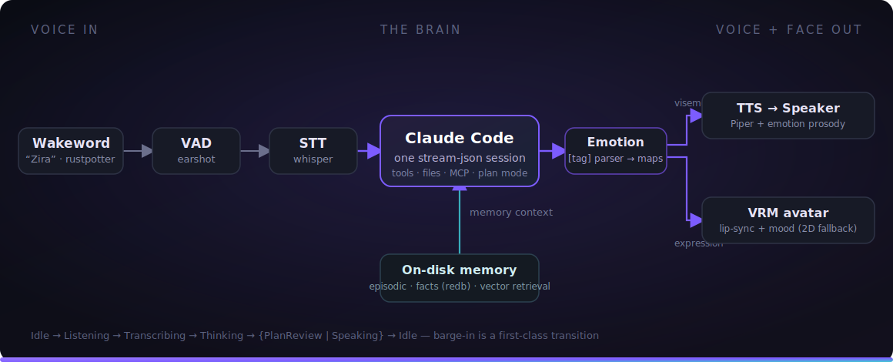
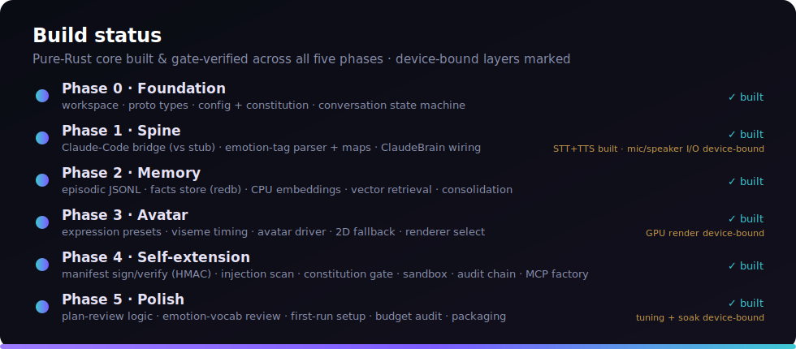

<div align="center">



# Zira

**A voice-driven coding helper & assistant — built _on top of_ Claude Code, in pure Rust.**

Wake it with your voice, talk to it, and watch an expressive avatar answer back —
with emotion, memory, and the ability to extend itself. Zira wraps the official
`claude` binary as its brain and adds everything Claude Code doesn't have: voice,
a face, persistent memory, and self-extension — all sized to run on a **CPU-first**
machine with no discrete GPU.

[](https://github.com/voldiguarddevelopment/Zira/actions/workflows/ci.yml)
[](https://www.rust-lang.org)
[](#license)
[](#how-this-was-built)

</div>

---

## The idea

> **Zira is a shell around Claude Code, not a reimplementation of it.**

The official `claude` binary already provides the full agent loop — tool use, file
editing, bash, web, subagents, MCP servers, skills, hooks, and permission modes
(including plan mode). Zira keeps that brain exactly as-is and bolts on the four things
it lacks:

1. 🎙️ **Voice I/O with emotion** — wakeword → speech-to-text in; emotion-tagged
   text-to-speech out.
2. 🧑‍🎤 **An embodied avatar** — a VRM model with lip-sync, idle motion, and
   emotion-driven expression.
3. 🧠 **Custom on-disk memory** — layered, retrieval-augmented, self-consolidating.
4. 🧩 **Self-extension** — authoring its own Skills and MCP servers behind a safety gate.

Everything routes through one long-lived Claude Code session over its stream-json
protocol.

---

## Architecture

<div align="center">



</div>

The orchestrator (`zira-core`) is an explicit **state machine** on a Tokio event bus —
`Idle → Listening → Transcribing → Thinking → {PlanReview | Speaking} → Idle` — with
**barge-in** as a first-class transition. In `Idle`, only the cheap wakeword detector is
hot; heavy models load once at startup and stay resident. The model emits inline
`[Emotion]` tags, and a single parser drives **both** TTS prosody and avatar expression
from that one stream.

---

## Highlights

- 🦀 **Pure-Rust harness.** The only non-Rust artifact is the official `claude` binary
  (the universal agent substrate). Everything Zira adds is Rust.
- 💻 **CPU-first, no GPU required.** Wakeword, VAD, STT, TTS, embeddings, and memory all
  run on a CPU (tiny/quantized models). The 3D avatar is the one part with a GPU floor —
  an *integrated* GPU suffices, and a GPU-less box falls back to a 2D face.
- 🗣️ **Emotion as a first-class signal.** Inline `[Emotion]` tags drive **both** TTS
  prosody and avatar expression from a single stream.
- ⚡ **Barge-in built in.** A formal conversation state machine lets you interrupt
  mid-sentence — the avatar stops, listens, and re-engages.
- 🔒 **Safe self-extension.** New skills/MCP servers pass an immutable constitution +
  sandbox + prompt-injection scan + HMAC-signed manifest + HMAC-chained audit before
  going live.
- 🛡️ **Token isolation.** The spawned `claude` agent never sees Zira's secrets.

---

## Workspace layout

A ten-crate Rust workspace; each crate owns one concern.

| Crate | Responsibility |
|-------|----------------|
| [`zira`](crates/zira) | The binary: wires everything together, owns the runtime |
| [`zira-core`](crates/zira-core) | Event bus + orchestrator + conversation state machine |
| [`zira-bridge`](crates/zira-bridge) | The Claude Code **stream-json driver** (spawn, prompt, parse answer + usage, typed errors) |
| [`zira-proto`](crates/zira-proto) | Shared types: the `Event`, `State`, and `Emotion` vocabulary + payloads |
| [`zira-config`](crates/zira-config) | Config, XDG paths, and the immutable constitution |
| [`zira-emotion`](crates/zira-emotion) | `[Emotion]`-tag parser + emotion→{prosody, expression} maps |
| [`zira-voice`](crates/zira-voice) | Wakeword / VAD / STT / TTS pipeline (CPU) |
| [`zira-memory`](crates/zira-memory) | On-disk layered memory: episodic, facts (redb), CPU embeddings, vector retrieval |
| [`zira-avatar`](crates/zira-avatar) | Viseme/expression driver + 2D fallback + Bevy VRM renderer |
| [`zira-skills`](crates/zira-skills) | Skill/MCP factory + the self-extension safety gate |

---

## Build status

Zira is built **test-first behind deterministic gates** (see
[How this was built](#how-this-was-built)) — a task is `done` only when its frozen tests
pass and mutation confirms they defend the code, never by assertion. The work splits into
a **pure-Rust, CPU-gateable core** (which the harness builds and verifies autonomously)
and **device-bound layers** (live audio, the GPU avatar render, model assets) that need a
human and real hardware.

<div align="center">



</div>

**✅ Built &amp; gate-verified — the entire pure-Rust core, all five phases:**

- **Foundation** — the ten-crate workspace, shared deps, lint policy; `zira-proto`
  (`Emotion`/`State`/`Event` + payloads); `zira-config` (schema, TOML load, XDG paths,
  the immutable constitution, validation); `zira-core` (transition table, Tokio event
  bus, select-loop, silence timeout, stage traits + the full mocked `Idle → … → Idle`
  cycle).
- **Spine** — `zira-bridge` (drives `claude`, composes the prompt, parses the answer +
  token usage, typed errors — proven against a **stub `claude`**); `zira-emotion`
  (tag parse → emotion segments → prosody); the `ClaudeBrain` that turns a transcript
  into emotion-segmented speech events.
- **Memory** — episodic JSONL with a cap, the facts store (redb), the `Embedder` trait,
  a cosine vector index, retrieval, prompt-context injection, and the consolidation pass.
- **Avatar logic** — emotion→expression presets, viseme vocabulary + timing, the pure
  `AvatarDriver` state machine, the 2D-fallback frame, and renderer selection.
- **Self-extension** — manifest parse, HMAC sign/verify, the prompt-injection scan, the
  constitution capability gate, the path sandbox, the HMAC audit chain, the skill
  registry, and the MCP-config factory.
- **Polish** — plan-review logic, emotion-vocabulary review, first-run setup, the
  resource-budget audit, and packaging.

**🧩 Real model inference — built &amp; gate-verified, runs once the model asset is on disk:**

- **Embeddings** — `CandleEmbedder` loads all-MiniLM-L6-v2 and produces real 384-d vectors
  (CPU, candle).
- **STT** — `WhisperStt` transcribes a PCM buffer with Candle whisper-tiny.en (the test
  transcribes the JFK fixture verbatim).
- **TTS** — `PiperTts` synthesizes text to 22 kHz PCM via a Piper VITS voice (espeak-ng
  phonemes → ONNX runtime), plus per-phoneme viseme frames.

> Each is mutation-defended and runs for real on a box that has the model file (whisper /
> Piper / embedding assets, fetched out-of-band); a model-less CI skips them so it stays green.

**🟡 Device-bound — needs a human + real hardware (can't be a frozen-test gate):**

- **Live audio I/O** — wakeword + VAD on a real microphone, and speaker playback of the
  synthesized audio.
- **GPU avatar** — the Bevy/VRM render loop on an integrated GPU with a `.vrm` model.
- **On-hardware tuning** — barge-in threshold tuning and the long-running soak test.

---

## The pure-Rust stack (CPU-first)

| Component | Approach | Purity |
|-----------|----------|--------|
| Async runtime / bus | Tokio | pure |
| Claude Code bridge | custom, over the `claude` binary | pure harness |
| Wakeword | rustpotter (custom-trained) | pure |
| VAD | earshot (pure-Rust WebRTC VAD) | pure |
| STT | Candle whisper-tiny.en (CPU, pure-Rust) — **built** | pure |
| TTS | Piper VITS via `ort` (CPU) + espeak-ng phonemes — **built** | FFI (ONNX) |
| Emotion | `zira-emotion` parser + maps | pure |
| Embeddings | Candle (all-MiniLM-L6-v2, CPU) | pure |
| Vector index | cosine brute-force (`zira-memory`) | pure |
| Facts store | redb | pure |
| Avatar | Bevy + `bevy_vrm` (integrated GPU) | pure (GPU floor) |

---

## Getting started

> **Heads up:** the entire pure-Rust core builds and tests today across all five phases.
> The end-to-end voice loop additionally needs the device-bound layers above — audio
> devices, the voice/embedding models, and (for the 3D avatar) an integrated GPU — plus a
> one-time model/wakeword setup.

### Install

The [`install.sh`](install.sh) script checks prerequisites (Rust + `git` + the `claude`
CLI), builds the workspace, installs the `zira` binary, and sets up the XDG config/data
directories — idempotent and safe to re-run:

```bash
git clone https://github.com/voldiguarddevelopment/Zira.git
cd Zira && ./install.sh
```

### Or build by hand

```bash
# Build the whole workspace
cargo build --workspace

# Run the test suite (frozen tests + properties)
cargo test --workspace

# Explore a crate
cargo run -p zira -- --help
```

**Requirements:** a stable Rust toolchain. The full assistant additionally needs a
microphone + speaker, the quantized voice models, an embedding model, and (for the 3D
avatar) an integrated GPU.

---

## How this was built

Zira is built by **[Ratchet](https://github.com/voldiguarddevelopment/Ratchet)**, a
hardened autonomous TDD harness. Every change runs a strict gate cascade —
integrity → checker → compile → frozen tests → mutation — and the project's three
documents (`plan.md` / `spec.md` / `list.md`) are reconciled against the code on every
pass. The core rule is **no stubs, no simplified implementations, no fake passes**: a
green that isn't real is rejected by construction. That's exactly why the build status
above is precise about what is *proven* versus *device-bound* — the harness will not
mark a task done on belief. (It also catches its own mistakes: when one task once edited
another task's frozen test, the next integrity check refused to build until it was fixed
honestly.)

---

## Ethics & consent

A voice assistant that listens and remembers carries real responsibility. Zira keeps
its memory **local and on-disk** (under your XDG data dir, never uploaded), strips its
own secrets from the agent it spawns, and gates self-extension behind an immutable
constitution. The roadmap treats consent and safety as requirements, not features.

---

## License

License TBD. Until a license file is added, all rights reserved by the project owners.

<div align="center">
<sub>Built with 🦀 and <a href="https://github.com/voldiguarddevelopment/Ratchet">Ratchet</a> · voldiguarddevelopment</sub>
</div>
